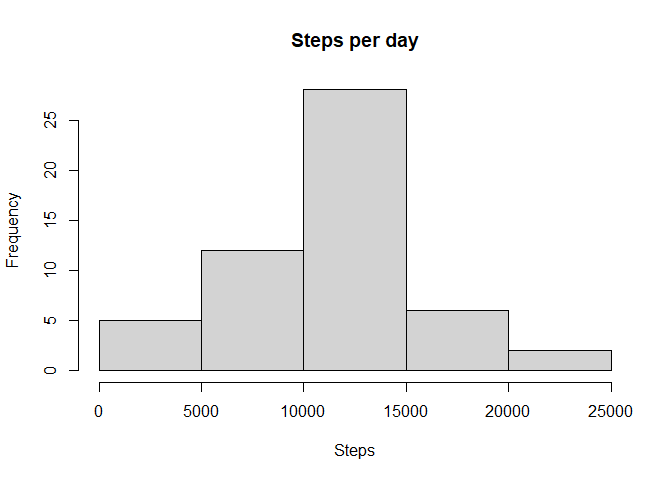
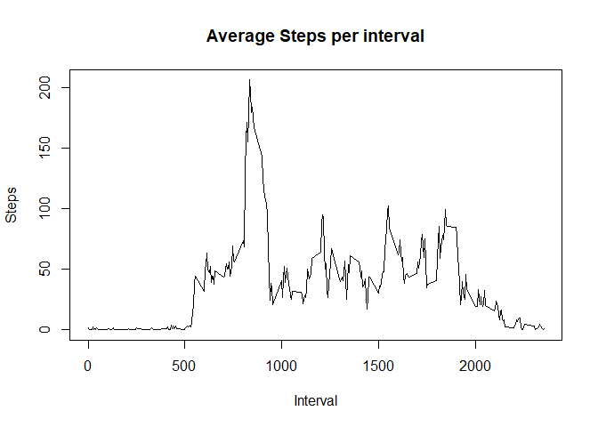
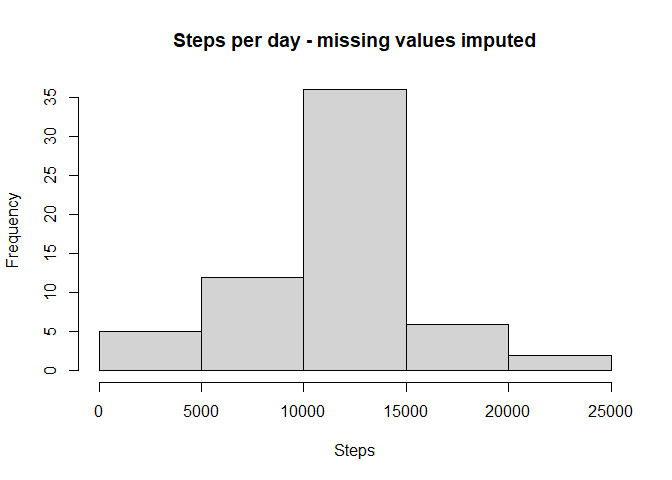
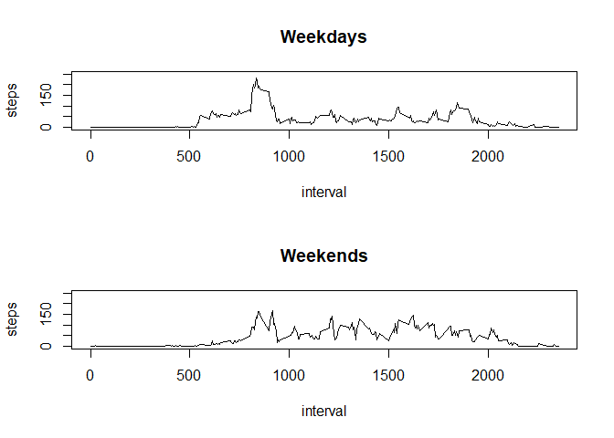

# Introduction

This R Markdown document concerns the assignment for the course Reproducible Research of the Data Science specialization offered through Coursera.This assignment makes use of data from a personal activity monitoring device. This device collects data at 5 minute intervals through out the day. The data consists of two months of data from an anonymous individual collected during the months of October and November, 2012 and include the number of steps taken in 5 minute intervals each day.

After we fork the following github repository <https://github.com/rdpeng/RepData_PeerAssessment1> the zipped data are included. The variables included in this dataset are:

- steps: Number of steps taking in a 5-minute interval (missing values are coded as NA)

- date: The date on which the measurement was taken in YYYY-MM-DD format

- interval: Identifier for the 5-minute interval in which measurement was taken

The dataset is stored in a comma-separated-value (CSV) file and there are a total of 17,568 observations in this dataset.
More information are included in the **readme file**.

## Loading and preprocessing the data

We first unzip the file to a csv and then load it


```r
activity <- read.csv(unz("activity.zip", "activity.csv"))
```

We can have a quick look at the data with summary and str


```r
summary(activity)
```

```
##      steps            date              interval     
##  Min.   :  0.00   Length:17568       Min.   :   0.0  
##  1st Qu.:  0.00   Class :character   1st Qu.: 588.8  
##  Median :  0.00   Mode  :character   Median :1177.5  
##  Mean   : 37.38                      Mean   :1177.5  
##  3rd Qu.: 12.00                      3rd Qu.:1766.2  
##  Max.   :806.00                      Max.   :2355.0  
##  NA's   :2304
```

```r
str(activity)
```

```
## 'data.frame':	17568 obs. of  3 variables:
##  $ steps   : int  NA NA NA NA NA NA NA NA NA NA ...
##  $ date    : chr  "2012-10-01" "2012-10-01" "2012-10-01" "2012-10-01" ...
##  $ interval: int  0 5 10 15 20 25 30 35 40 45 ...
```

Steps variable is integer and has 2304 missing values. Date is character and interval is integer.

## What is mean total number of steps taken per day?

For this part of the assignment, we ignore the missing values in the dataset.

We calculate the total number of steps taken per day. We make a histogram of the total number of steps taken each day. And we calculate and report the mean and median of the total number of steps taken per day.


```r
stepsPerDay <- aggregate(steps ~ date, activity, sum)
#stepsPerDay
hist(stepsPerDay$steps, main = "Steps per day", xlab = "Steps")
```

<!-- -->

```r
meanStepsPerDay <- mean(stepsPerDay$steps)
meanStepsPerDay
```

```
## [1] 10766.19
```

```r
medianStepsPerDay <- median(stepsPerDay$steps)
medianStepsPerDay
```

```
## [1] 10765
```

Mean is 10766.19 steps and median is 10765 steps.

## What is the average daily activity pattern?

We make a time series plot (i.e. type = "l") of the 5-minute interval (x-axis) and the average number of steps taken, averaged across all days (y-axis)


```r
stepsPerInterval <- aggregate(steps ~ interval, activity, mean)
#stepsPerInterval
plot(stepsPerInterval$interval, stepsPerInterval$steps, main = "Average Steps per interval", type="l", xlab = "Interval", ylab = "Steps")
```

<!-- -->

The 5-minute interval which, on average across all the days in the dataset, contains the maximum number of steps is 


```r
stepsPerInterval$interval[which.max(stepsPerInterval$steps)]
```

```
## [1] 835
```

with 206 steps.

## Imputing missing values

We noted that there are a number of days/intervals where there are missing values (coded as NA). The presence of missing days may introduce bias into some calculations or summaries of the data.

We calculate and report the total number of missing values in the dataset (i.e. the total number of rows with NAs)


```r
nrow(activity[is.na(activity$steps),])
```

```
## [1] 2304
```

```r
nrow(activity[is.na(activity$date),])
```

```
## [1] 0
```

```r
nrow(activity[is.na(activity$interval),])
```

```
## [1] 0
```

We have 2304 missing values on the steps column as we expected also from the summary command in the beginning of the analysis.

Our strategy for filling in all of the missing values in the dataset is to use the mean for that 5-minute interval across the days as calculated in the stepsPerInterval variable.


```r
activitynew<-merge(activity,stepsPerInterval, by="interval")
head(activitynew)
```

```
##   interval steps.x       date  steps.y
## 1        0      NA 2012-10-01 1.716981
## 2        0       0 2012-11-23 1.716981
## 3        0       0 2012-10-28 1.716981
## 4        0       0 2012-11-06 1.716981
## 5        0       0 2012-11-24 1.716981
## 6        0       0 2012-11-15 1.716981
```

```r
activitynew[is.na(activitynew$steps.x), "steps.x"] <- activitynew[is.na(activitynew$steps.x), "steps.y"]
head(activitynew)
```

```
##   interval  steps.x       date  steps.y
## 1        0 1.716981 2012-10-01 1.716981
## 2        0 0.000000 2012-11-23 1.716981
## 3        0 0.000000 2012-10-28 1.716981
## 4        0 0.000000 2012-11-06 1.716981
## 5        0 0.000000 2012-11-24 1.716981
## 6        0 0.000000 2012-11-15 1.716981
```

Activitynew is the dataset (after the following modifications) that is equal to the original dataset but with the missing data filled in.


```r
#keep only interval, steps.x and date
activitynew<-activitynew[,1:3]
#rename steps.x to steps
colnames(activitynew)<-c("interval","steps","date")
head(activitynew)
```

```
##   interval    steps       date
## 1        0 1.716981 2012-10-01
## 2        0 0.000000 2012-11-23
## 3        0 0.000000 2012-10-28
## 4        0 0.000000 2012-11-06
## 5        0 0.000000 2012-11-24
## 6        0 0.000000 2012-11-15
```

```r
#stepsPerIntervalnew <- aggregate(steps.x ~ interval, activitynew, mean)
```

We also make a histogram of the total number of steps taken each day and Calculate and report the mean and median total number of steps taken per day. 


```r
stepsPerDaynew <- aggregate(steps ~ date, activitynew, sum)
#stepsPerDaynew
#stepsPerDay
hist(stepsPerDaynew$steps, main = "Steps per day - missing values imputed", xlab = "Steps")
```

<!-- -->

```r
meanStepsPerDaynew <- mean(stepsPerDaynew$steps)
meanStepsPerDaynew
```

```
## [1] 10766.19
```

```r
medianStepsPerDaynew <- median(stepsPerDaynew$steps)
medianStepsPerDaynew
```

```
## [1] 10766.19
```

Mean is 10766.19 steps and median is 10766.19 steps. After missing values imputation the mean and the median are the same. This is explained by the type of imputation we applied. Having a closer look to the following two variables:


```r
stepsPerDaynew
stepsPerDay
```

**we observe that we had missing values in all the intervals of 8 specific days. So, with the selected missing value imputation strategy, each of these 8 days (per interval) got the mean value of steps**

## Are there differences in activity patterns between weekdays and weekends?

We use the dataset with the filled-in missing values for this part. We create a new factor variable in the dataset with two levels -- "weekday" and "weekend" indicating whether a given date is a weekday or weekend day.


```r
activitynew$day <- as.POSIXlt(activitynew$date)$wday
head(activitynew)
```

```
##   interval    steps       date day
## 1        0 1.716981 2012-10-01   1
## 2        0 0.000000 2012-11-23   5
## 3        0 0.000000 2012-10-28   0
## 4        0 0.000000 2012-11-06   2
## 5        0 0.000000 2012-11-24   6
## 6        0 0.000000 2012-11-15   4
```

```r
activitynew$daylevel <- as.factor(ifelse(activitynew$day == 0 | activitynew$day == 6, "weekend", "weekday"))
head(activitynew)
```

```
##   interval    steps       date day daylevel
## 1        0 1.716981 2012-10-01   1  weekday
## 2        0 0.000000 2012-11-23   5  weekday
## 3        0 0.000000 2012-10-28   0  weekend
## 4        0 0.000000 2012-11-06   2  weekday
## 5        0 0.000000 2012-11-24   6  weekend
## 6        0 0.000000 2012-11-15   4  weekday
```

We then make a panel plot containing a time series plot (i.e. type = "l") of the 5-minute interval (x-axis) and the average number of steps taken, averaged across all weekday days or weekend days (y-axis).


```r
weekdays <- activitynew[activitynew$daylevel == "weekday",]
weekends <- activitynew[activitynew$daylevel == "weekend",]
stepsPerIntervalWeekdays <- aggregate(steps ~ interval, weekdays, mean)
stepsPerIntervalWeekends <- aggregate(steps ~ interval, weekends, mean)

par(mfrow = c(2, 1))

plot(stepsPerIntervalWeekdays, type = "l", main = "Weekdays", ylim=c(0,250))
plot(stepsPerIntervalWeekends, type = "l", main = "Weekends", ylim=c(0,250))
```

<!-- -->

Activity patterns are different among weekdays and weekends. During weekdays there is a peak before interval 1000 (morning), while in weekends the number of steps is smaller in the morning, but larger later on.
